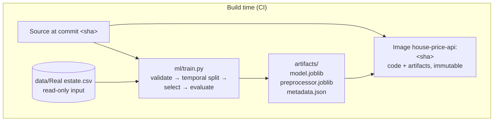
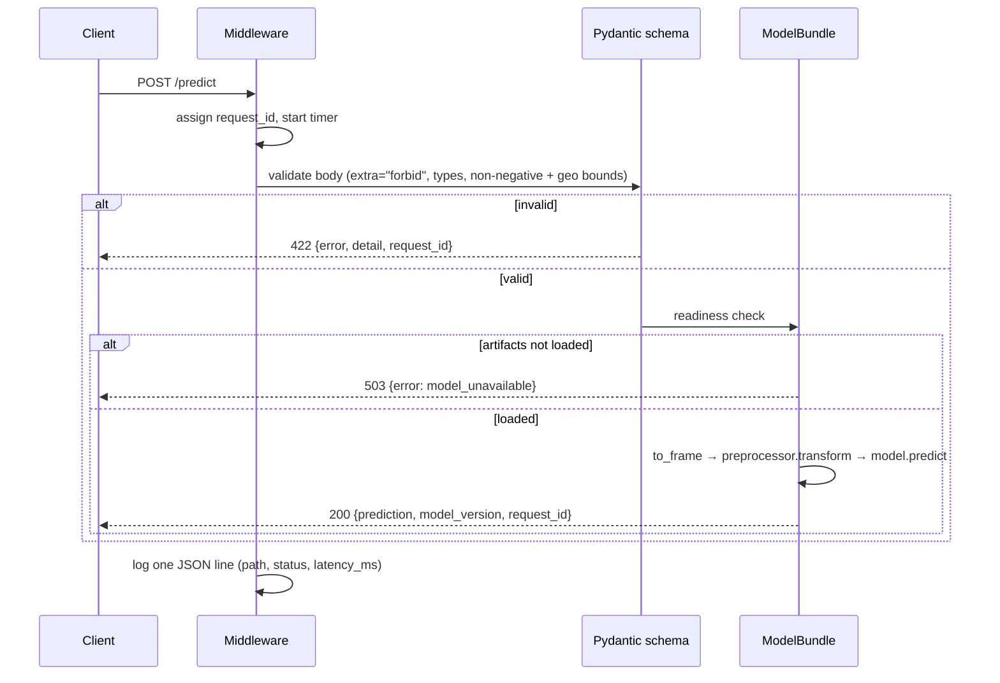
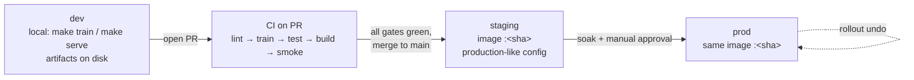

# Architecture

## Deployment architecture

**The load-bearing idea:** the artifacts are inside the image. There is no runtime artifact fetch,
no shared volume, no "which model did this pod pick up?" question. The tag `<sha>` identifies code
and model as one unit, and `GET /model/info` lets any running instance prove which one it is.

## Request path

## Environments and promotion

| Environment | Purpose | Data | Promotion in |
|---|---|---|---|
| dev | Local iteration; `make serve` against artifacts built by `make train` | Provided CSV | — |
| staging | Verify the *image* behaves, with production-like configuration | Same CSV; mirrored traffic if available | Merge to `main` after all CI gates pass |
| prod | Serves real traffic | Same CSV | Manual approval after staging soak |

## Assumptions

1. **Single model, single consumer.** One regression model serves one contract. Most of the
   simplifications below follow from this.
2. **Low traffic.** Inference on a RandomForest over 5 features is microseconds; request overhead
   dominates. Nothing here is tuned for throughput because nothing needs to be yet.
3. **The dataset is a fixed, read-only input.** In reality it would be a scheduled extract; the
   retraining story in OPERATIONS.md assumes that eventually.
4. **Trusted network.** No authentication, rate limiting, or tenancy. Acceptable for an internal
   service behind a gateway; stated explicitly rather than left as an oversight.
5. **Artifacts are not sensitive.** They are baked into the image and uploaded by CI. A model with
   commercial value would need a private registry instead.

## Tradeoffs

| Choice | Bought | Cost | Revisit when |
|---|---|---|---|
| Artifacts baked into the image | One version to reason about; rollback = redeploy previous tag | Model-only rollback needs a rebuild | Models ship on a different cadence than code |
| No model registry (MLflow etc.) | ~0 infrastructure; `metadata.json` answers "which model" | No experiment history, no cross-run comparison UI | A second model or a second consumer exists |
| Training runs in CI | Proves single-command reproducibility on a clean machine; real artifacts for tests | Does not generalise past data volumes | Training exceeds a few minutes — then it becomes a scheduled job publishing pinned artifacts |
| Temporal split, `X1` dropped as a feature | Honest generalisation estimate; a request contract that does not decay over time | Gives up any learnable market trend | Enough history to validate a trend out of sample |
| Two candidate models, no tuning | A defensible baseline comparison inside the budget | Leaves some accuracy on the table | Accuracy becomes the binding constraint rather than reliability |
| Single sync process, no queue | Simplicity; latency dominated by network not compute | No backpressure handling | Traffic makes replicas insufficient |
| Structured logs only, no metrics backend | Zero dependencies; every field needed is already emitted | Aggregation requires a log pipeline to exist | Someone needs dashboards or histogram quantiles |
